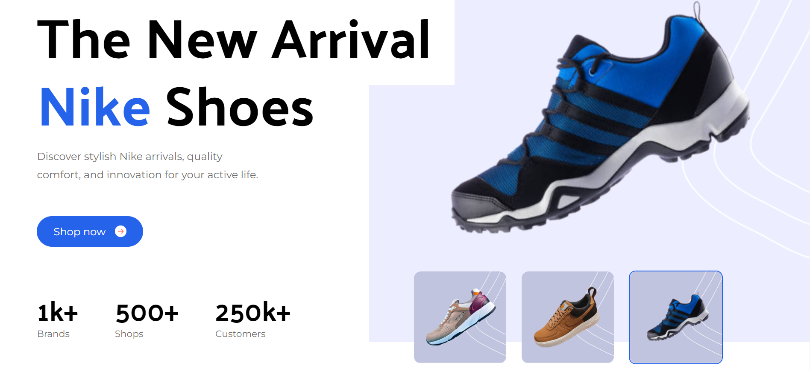
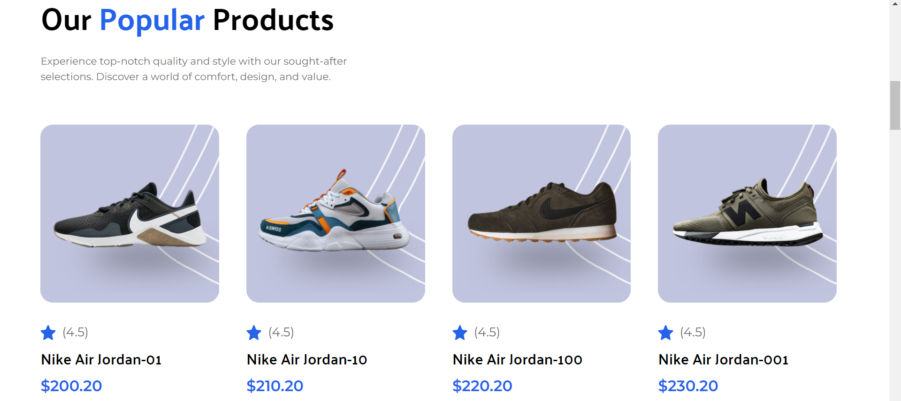

<h2 align="center">Nike Home Page   <a target="_blank" href="https://nikeshoeswear-home.netlify.app/">Live Demo</a></h2>

 

     

## About 

This project is a recreation of the Nike home page using React and Tailwind CSS. It showcases the latest in sportswear innovation, offers customization options, and highlights various collections and sustainability efforts.

These technologies are used to build this website:

<ul>
  <li>React.js</li>
  <li>TailwindCSS</li>
  <li>npm packages</li>
  
</ul>

Some of the features of this website are:

<ul>
  <li><strong>Responsive Design :</strong> The home page is fully responsive, ensuring a seamless experience across all devices.</li>
  <li><strong>Dynamic Content :</strong> Uses React components to dynamically render the content.</li>
  <li><strong>Styling with Tailwind CSS :</strong> Utilizes Tailwind CSS for easy and flexible styling.</li>
  <li><strong>Sport-Specific Gear :</strong> Showcases products tailored for different sports such as running, basketball, soccer, and training.</li>
  <li><strong>Customer Support :</strong> Includes a dedicated section for customer support and FAQs.</li>
  
  
</ul>

## Support

Show your support by leaving a star ⭐ on this repo, if you like the website.

Fell free to point out any bugs🪲 or improvements in the issues tab.

